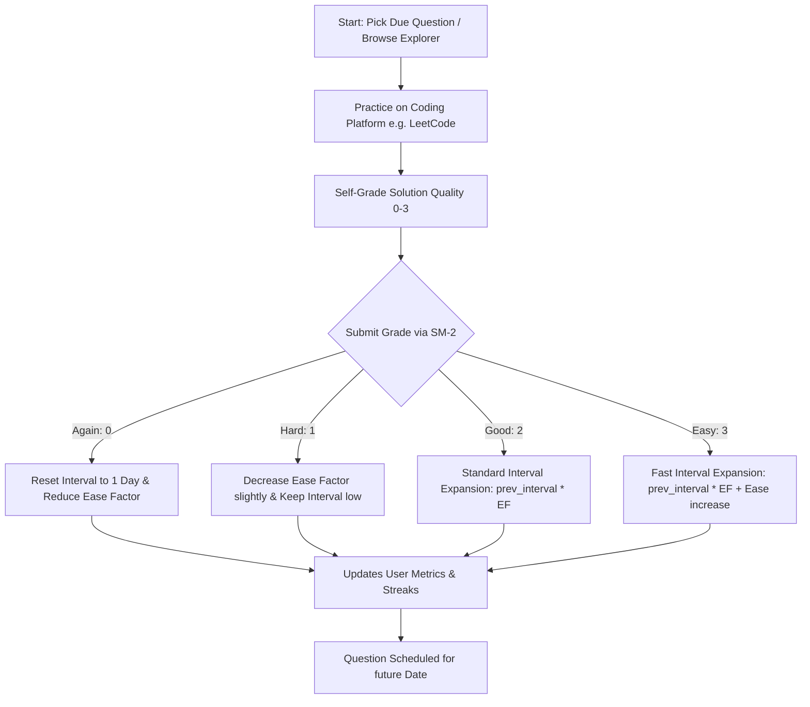

# DSA Spaced Repetition (SDE & A2Z Sheets)

An Anki-style spaced repetition revision engine built for software engineers preparing for technical interviews. The platform is pre-seeded with **665+ problems** across both **Striver's SDE Sheet (191 problems)** and **Striver's A2Z DSA Sheet (474 problems)**, dynamically scheduling coding revisions using the SuperMemo-2 (SM-2) algorithm.

The application follows a strict **Monochrome & Minimalist Brutalism** design system—offering a highly focused, distraction-free environment that prioritizes logic over design fluff.

---

## Why This App Exists

Preparing for technical SDE interviews is a marathon. Candidates often solve hundreds of problems on platforms like LeetCode or GeeksforGeeks, only to realize weeks later that they have forgotten the core patterns or optimal approaches to problems they previously solved. 

Re-solving sheets from scratch is highly inefficient. This application solves that by introducing **Spaced Repetition** to DSA preparation:
1. You practice coding problems directly on their native platforms (LeetCode, GFG, Coding Ninjas, etc.).
2. You grade your recall quality and speed.
3. The system dynamically schedules your next review date, ensuring you revise the problems right when you are about to forget them.

---

## How It Works

### 1. The Spaced Repetition Loop
*   **Explorer**: Browse the entire 191-problem Striver SDE sheet. Click **SOLVE ↗** to open the actual coding platform directly.
*   **Self-Grading**: Once solved, click **REVIEW** and submit a grade from `0` to `3` based on your performance:
    *   **Again (0)**: Memory blackout / failed to solve. reschedules for **tomorrow** (1 day) and reduces the ease factor.
    *   **Hard (1)**: Correct but with major hesitation or suboptimal code. Schedules a quick review.
    *   **Good (2)**: Correct with normal speed/recall. Schedules standard progression.
    *   **Easy (3)**: Solved instantly with clean, optimal code. Multiplies the schedule interval rapidly.
*   **Queue**: Problems automatically enter your review queue. Each day, the app presents only the questions that are **due** for revision.

### 2. Under the Hood: The SM-2 Algorithm
The application utilizes the classic SuperMemo-2 (SM-2) algorithm (famous for power-learning apps like Anki) to calculate dynamic review schedules. 

Every time you submit a review, the engine updates three variables for that problem:
*   **Consecutive Repetitions ($R$)**: The number of consecutive successful reviews.
*   **Ease Factor ($EF$)**: A multiplier representing how easy the problem is for you (defaults to `2.5` and ranges down to `1.3`).
*   **Interval ($I$)**: The number of days before the problem is scheduled next.
    *   $I_1 = 1$ day
    *   $I_2 = 4$ days
    *   $I_n = I_{n-1} \times EF$ (for subsequent passes)

### 3. Progress Tracking & Analytics
*   **Daily Solve Streak**: Tracks your consistency. Solve at least one due review per day to keep your streak alive.
*   **28-Day Heatmap**: A raw visual calendar tracking the days you successfully completed coding revisions.
*   **7-Day Review Forecast**: A CSS-based forecast chart showing how many reviews are scheduled to hit your queue each day of the upcoming week.
*   **Topic Progress**: Dynamic completion bars showing your coverage across all SDE sheet topics (Arrays, Trees, Graphs, DP, Tries, etc.).
